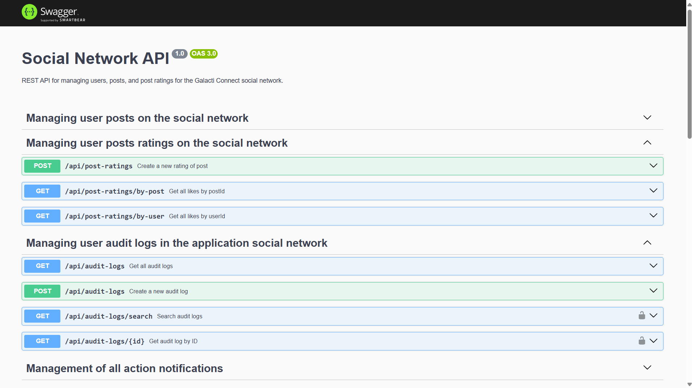

<h1 align="center">
Social Network API
</h1>

<p align="center">

</p>
<h2 align="center">
Galactic Connection 
</h2>
This API provides services for a social networking web application for beings of all galactic races.

## Technologies 🔧

<p align="center">
  <a href="https://nestjs.com/" target="_blank">
  
  </a>
  <a href="https://www.typescriptlang.org/" target="_blank">
  
  </a>
  <a href="https://www.postgresql.org/" target="_blank">
  
  </a>
  <a href="https://typeorm.io/" target="_blank">
  
  </a>
  <a href="https://socket.io/" target="_blank">
  
  </a>
  <a href="https://swagger.io/" target="_blank">
  
  </a>
  <a href="https://jestjs.io/" target="_blank">
  
  </a>
  <a href="https://www.docker.com/" target="_blank">
  
  </a>
  <a href="https://www.npmjs.com/" target="_blank">
  
  </a>
</p>

## Other settings in the project

|   <!-- -->   | <!--   -->  |    <!-- -->    |
| :----------: | :---------: | :------------: |
|  _Tsconfig_  | _Prettier_  |    _Winston_   |
|   _Eslint_   |    _Ejs_    |      _JWT_     |
|    _Git_     |  _log4js_   |    _moment_    |
| _Pre-commit_ |  _NestJS_   |  _PostgreSQL_  |
|   _Docker_   | _socket-io_ |  _Typescript_  |

## Starting 🚀

_These instructions will allow you to get a copy of the project running on the local machine for development and testing purposes._

See **Deployment** to learn how to deploy the project.

### Pre- requirements 📋

- _NodeJS_ current version v20.13.1
- _PostgreSQL_ 

##### Recommended 📋

- _DBeaver_
- _Warm_
- _Trae_
- _GitHub Desktop_

### Installation 🔧

**To install the project locally and run the api please execute the following steps**

_Clone the social-network-api repository from github_

```bash
git clone https://github.com/desobsesor/social-network-api.git
```

_Install the dependencies_

```bash
npm i
```

_Set configuration.env_

```bash
Set your environment variables in the .env file
```

_Set initial data in seeder_
```bash
npm run seed   
```

_Compile the project and start the server_

```bash
npm run start-env
```

## Swagger 📦

_Invoke the API documentation endpoint_

```bash
http://localhost:4000/api
```

<p align="center">


</p>

## Deployment 📦

_Compile the project and build the application sources_

```bash
npm run compile
```

## Built with 🛠️

_Tools and Technologies used_

- [NodeJS](https://nodejs.org/en/) - Server-side JavaScript environment,uses an asynchronous and event-driven model
- [NestJS](https://nestjs.com/) - Fast, unopinionated, minimalist web framework
- [Npm](https://www.npmjs.com/) - Dependency manager
- [PostgreSQL](https://www.postgresql.com/) - Database engine
- [TypeORM](https://typeorm.io/) - ORM for TypeScript and JavaScript
- [Swagger](https://swagger.io/) -Swagger is an open specification for defining APIs

## Authors ✒️

_Built by_

- **Yovany Suárez Silva** - _Full Stack Software Engineer_ - [desobsesor](https://github.com/desobsesor)

## License 📄

This project is under the MIT License - see the file [LICENSE.md](LICENSE.md) for details
